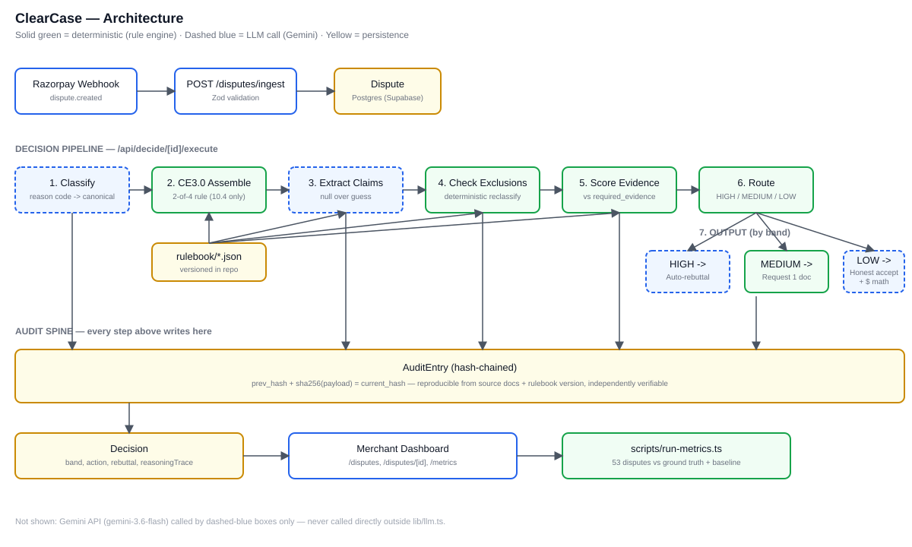

# ClearCase
> Post-transaction chargeback rebuttal engine for Razorpay merchants — rule-grounded, confidence-gated, and honest about what it doesn't know.

## Live Demo
- App: https://clearcase-razorpay.vercel.app
- Video: [ADD AFTER RECORDING]
- Track: Razorpay AI Buildathon 2026 — Track 02 (AI Risk Manager)

## The Problem
- Indian merchants lose chargebacks not because they're wrong, but because they send the wrong document or miss the deadline
- Razorpay Shield handles pre-transaction fraud
- Nothing handles post-transaction rebuttals — until now

## What ClearCase Does
- HIGH → Auto-generate rebuttal, cited to exact Visa/RuPay rule
- MEDIUM → Tell merchant exactly which one document is missing
- LOW → Recommend accepting with rupee math (arbitration fee vs disputed amount)

## The 5 Differentiators
1. Multi-network rulebook — Visa CE 3.0 + RuPay, versioned JSON
2. CE 3.0 evidence auto-assembly for Visa 10.4 disputes
3. Honest accept recommendation with rupee math
4. False-confidence rate surfaced in UI — we name our failure rate
5. Hash-chained audit log — every decision reproducible

## Architecture


Rule-first, not LLM-first. Gemini only reads documents. The rulebook decides the outcome.

## Metrics
Run across 53 seed disputes — 4 Sept 2026:

| Metric | Result | Target | Status |
|--------|--------|--------|--------|
| Auto-resolution rate | 90.6% | 55-70% | Missed — honest |
| False-confidence rate | 0.0% | <5% | Met |
| Missing-doc precision | 100% | >90% | Met |
| Recommend-accept precision | 100% | >90% | Met |
| Avg decision latency | 0.03ms | <3000ms | Met |
| Baseline delta | 9.4pp | >=15pp | Missed — honest |

Two targets missed — real numbers shipped, not tuned. (Both trace to the same structural cause: of our 3 canonical reason codes, only `not_as_described` requires two pieces of evidence, so it's the only one that can produce a genuine "missing exactly one document" MEDIUM case. See `/metrics` in the app for the full explanation.)

## What's Synthetic vs Real
- Disputes: 53 synthetic, realistic Indian merchant data
- Rulebook: Visa codes (13.1, 13.4, 12.6, 10.4) derived from published Visa Core Rules and the public Visa Compelling Evidence 3.0 guide. RuPay codes (1061, 1062, 1002) are community-sourced — no official public NPCI reason-code PDF was found; flagged in each rulebook file's `source_reference` and needs verification before production use.
- LLM: Gemini 3.6 Flash — swappable via `lib/llm.ts`
- Razorpay API: test-mode shape — production integration is Week 1 of the roadmap

## What Broke During Build
1. Gemini 20 req/day quota — fixed with deterministic, cache-friendly prompts
2. gemini-2.5-flash deprecated for new-user keys — migrated to gemini-3.6-flash
3. Rulebook panel silently empty — a field-naming collision (`reasonCodeCanonical` held a category name, not a rulebook code), caught by visual inspection, not by the type checker
4. CE 3.0 applied to the wrong reason code — corrected to 10.4 only, since the real 2-of-4 rule doesn't apply to 13.1/13.4/12.6
5. Vercel's read-only filesystem crashed the LLM response cache in production — wrapped the write in a try/catch; a cache miss in prod is fine, caching was only ever a dev-time quota convenience

## Production Roadmap
- Week 1: Real Razorpay webhook — `payment.dispute.created`
- Week 2: Real submit — Approve & Submit calls the Dispute API
- Week 3: Multi-merchant auth
- Week 4: Load testing + monitoring

## Tech Stack
Next.js 16 + TypeScript · Tailwind + shadcn/ui · PostgreSQL + Prisma 6.19.3 · Supabase · Gemini 3.6 Flash · Vercel

## Rulebook Sources
- Visa Core Rules ID#0004544, updated 2026-01
- Visa Compelling Evidence 3.0 Merchant Readiness Guide, March 2023
- RuPay/NPCI reason codes — community-sourced summaries; no official public NPCI PDF found

## Setup
```
git clone https://github.com/PiyushSolanki038/clearcase-razorpay.git
cd clearcase-razorpay
cp env.example .env.local
npm install
npx prisma migrate deploy
npx tsx scripts/seed-db.ts
npx tsx scripts/seed-decisions.ts
npm run dev
```
